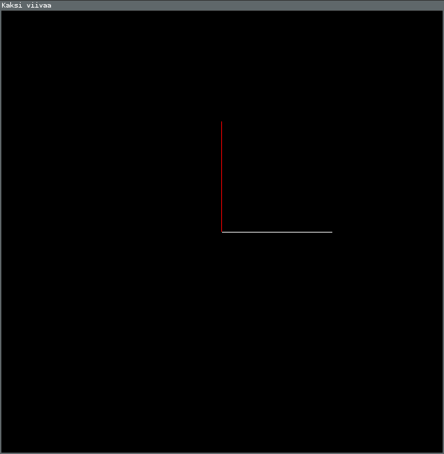

# Viivojen piirtäminen



Tässä on esimerkkiohjelma, joka piirtää kaksi viivaa. Yllä on kuva siitä, miltä näytti kun käynnistin sen omalla koneellani.

$$$viivat/main.go$$$

### Miten saan ajettua ohjelman?

Luo uusi kansio, kopioi koodi ja tallenna se .go-päätteiseen tiedostoon, joka sijaitsee äsken luomassasi kansiossa. Sitten avaa komentorivi kansiossa, ja kirjoita siihen `go run tiedostonnimi` tai `go build && ./kansionnimi`; se, kumpaa käytät on ihan makuasia.

### Miten ohjelma toimii?

Tämä ohjelmä piirtää viivansa OpenGL:llä. Se ei ole aivan helpoin tapa, mutta esimerkiksi tietokonepelejä on tehty paljon samalla tavalla.

```Go
gl.Begin(gl.LINES)
```

Tämä funktio kertoo mitä halutaan piirtää, ja sen jälkeen voi listata pisteitä. `gl.LINES` kertoo, että piirretään viivoja.

```Go
gl.Color3d(1, 0, 0)
gl.Vertex2d(0, 0)
gl.Vertex2d(0, 0.5)
```

`gl.Vertex2d` piirtää kaksiulotteisen pisteen. On olemassa myös `gl.Vertex3d`, joka piirtää kolmiulotteisen pisteen. Yllättävää kyllä, viivassa on kaksi pistettä, joten Vertexiä pitää kutsua kahdesti yhtä viivaa varten.

Numerot kertovat pisteen sijainnin. `0, 0` on keskellä ikkunaa. Ensimmäinen koordinaatti kasvaa oikealle mentäessä ja toinen ylös mentäessä. Ikkunan reunassa kukin koordinaatti on `1` tai `-1`.

`gl.Color3d` valitsee värin jolla ollaan piirtämässä. Väri on siinä mielessä kolmiulotteinen, että siinä on kolme osaa: punainen, vihreä ja sininen.

Mikä ihmeen kolmiulotteinen väri? Tässä vaiheessa lienee hyvä paljastaa, että `3d` ei oikeasti tarkoita kolmiulotteista, vaan että funktio ottaa 3 doublea. Tyyppiä `float64` joskus kutsutaan nimellä double.

```Go
gl.End()
```

`gl.End()` piirtää annetut pisteet.

```Go
closedgl.Run(piirrä, 640, 640, "Kaksi viivaa")
```

Paketin `closedgl` funktio `Run` avaa annetunkokoisen ja -nimisen ikkunan. Tässä tapauksessa ikkuna on siis 640 pikseliä leveä ja korkea, ja sen nimi on `Kaksi viivaa`.

Ensimmäisenä argumenttina `Run` ottaa funktion, joka kertoo mitä tehdään kun ikkunaan pitäisi piirtää jotain. Sen on pakko ottaa yksi `float64`-tyyppinen argumentti, eikä se saa palauttaa mitään.

### Tehtäviä
Voit tehdä kaikki, tai vain kiinnostavimmalta kuulostavat.

#### Muotoja
 - Piirrä kaksi viivaa lisää niin, että muodostuu neliö.
 - Piirrä kolmio.
 - Piirrä risti.
 - Piirrä ympyrä. (Tämä on vaikea vaikka osaisit for-silmukan!)
 - Piirrä tikku-ukko.

#### Värejä
 - Tee toisesta viivasta vihreä ja toisesta sininen
 - Tee viivoista harmaat
 - Tee viivan alku- ja loppupisteestä eri värinen
 - Selvitä miten värit cyan, magenta ja keltainen saadaan aikaan
 - Etsi Googlesta color picker, ja ota siitä RGB-arvot haluamallesi värille (Sen paletin kolme suuntaa ovat muuten hue, saturation, value eli HSV.)